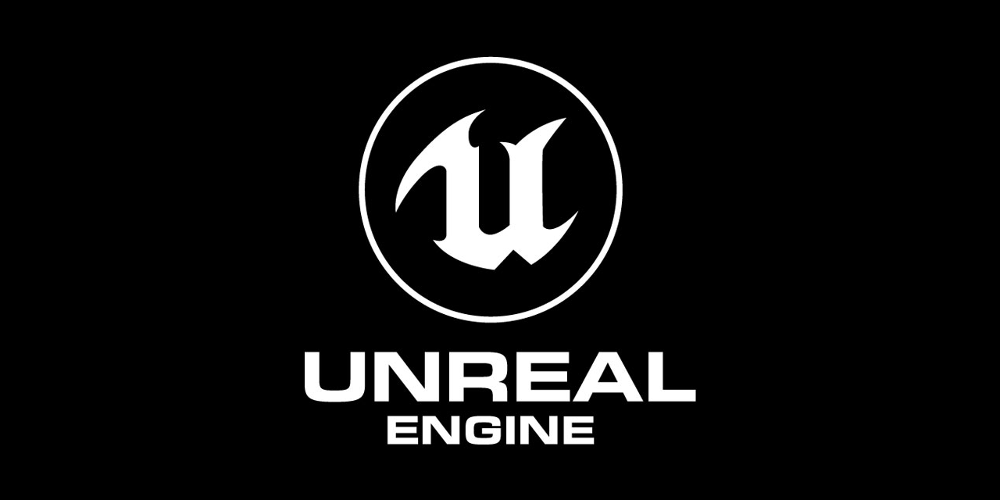
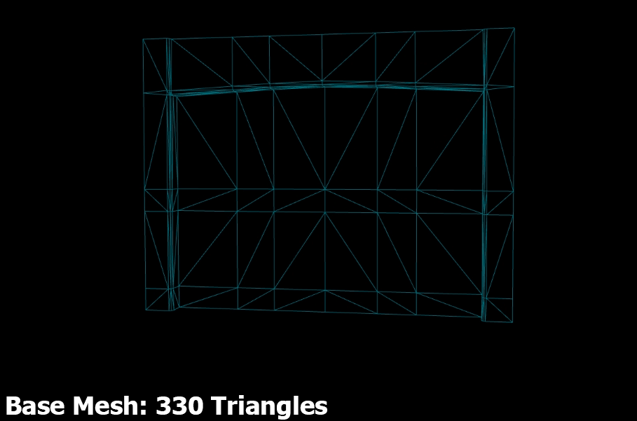

# Unreal Development Guides and Tips

Range of content including high-level concept explanations, detailed tutorials, performance considerations, shortcuts and other useful content that aims to improve your Unreal Engine 4 development journey.

Built with the community in mind. The end goal is to become a centralised knowledge base which will compliment official documentation as well as help a range of developers, whether just starting out or seasoned veterans experimenting with new features.

**Be sure to bookmark as updates are ongoing <(^_^<)**

## Content Directory

### Basic Scene Creation

Short guides/tricks on creating a level with aesthetically pleasing elements and lighting. Introduces dynamic light and actor light sources. Also considers pre-made content imports for quick starting.

*  [Adding content to a project](Content/Basics/AddingContentToAProject.md)
*  [Level creation](Content/Basics/LevelCreation.md)
*  [Improved scene lighting](Content/Basics/ImprovedSceneLighting.md)
*  [Actor light sources](Content/Basics/ActorLightSources.md)

### Improving Development Pipelines

Concepts/guides on cross-platform performance. Strong focus on optimisation and performance considerations in projects in conjunction with best practices. Covers a range of areas including Textures, Meshes, Materials, Texture Streaming, LODs, Lighting, Volumes and Reflections.

*  [Textures](Content/DevPipelines/Textures.md)
*  [Texture streaming](Content/DevPipelines/TextureStreaming.md)
*  [Static meshes](Content/DevPipelines/StaticMeshes.md)
*  [Importing and Exporting](Content/DevPipelines/ImportingAndExporting.md)
*  [Levels of Detail (LODs) and Static mesh merging](Content/DevPipelines/LODsAndMeshMerge.md)
*  [Materials I: Basics](Content/DevPipelines/MaterialsI.md)
*  [Materials II: Master materials and Material functions](Content/DevPipelines/MaterialsII.md)
*  [Materials III: Material instances](Content/DevPipelines/MaterialsIII.md)
*  [Materials IV: Vertex animation materials](Content/DevPipelines/MaterialsIV.md)
*  [Light, Shadow, and Post Process](Content/DevPipelines/LightShadowPostProcess.md)
*  [Volumes](Content/DevPipelines/Volumes.md)
*  [Reflections](Content/DevPipelines/Reflections.md)

### Real Time Ray Tracing (RTRT)

Concepts/guides on using how to make use of RTRT. Covers the hardware requirements to use the feature, basic discussion of each ray tracing component and how to implement each component in UE4. Furthermore, some additional command line features are mentioned and useful RTRT development tips.

* [Requirements and Configuration](Content/RTRT/RequirementsConfig.md)
* [Ray-Traced Shadows and Post Process Volume](Content/RTRT/ShadowsPostProcess.md)
* [Ray-Traced Reflections](Content/RTRT/Reflections.md)
* [Ray-Traced Translucency](Content/RTRT/Translucency.md)
* [Ray-Traced Ambient Occlusion](Content/RTRT/AmbientOcclusion.md)
* [Ray-Traced Global Illumination](Content/RTRT/GlobalIllumination.md)
* [Performance Analysis and Debugging](Content/RTRT/PerformanceDebug.md)
* [Path Tracer Benchmarking](Content/RTRT/PathTracer.md)

### Chaos Physics (delayed due to UE4 removal of Chaos from binary engine)

Concepts/guides on using Chaos Physics. Covers how to configure projects to use required Chaos features, destruction, vehicle physics, and the Chaos Fields system for controlling force fields to achieve a range of results. Note that Chaos Physics is currently in preview release and features are subject to change.

* [Plugin Configuration](Content/Chaos/PluginConfig.md)

### Converting Blueprints To C++

Concepts/guides on the benefits of using Blueprints versus C++. Covers the strengths and weaknesses of each approach, basic C++ architecture for maintainable design and the process of converting Blueprints to C++ implementations.

* [Blueprints vs C++]()

## Interesting Resources

* [Unreal Fest 2018 Presentations + Slides](https://www.unrealengine.com/en-US/events/unreal-fest-europe-2018)
* [Unreal Fest 2019 Presentations + Slides](https://www.unrealengine.com/en-US/events/unreal-fest-europe-2019)
* [Ray Tracing Gems: High-quality and real-time rendering with DXR and other APIs](http://www.realtimerendering.com/raytracinggems/unofficial_RayTracingGems_v1.6.pdf)

## References
* [Unreal Documentation](https://docs.unrealengine.com/)
* [Unreal Academy](https://academy.unrealengine.com/)
* [Unreal Wiki](https://ue4community.wiki/) (Lacks support for recent engine versions)
* [UE4 Trello Roadmap](https://trello.com/b/TTAVI7Ny/ue4-roadmap) (No longer updated post 4.25)
* [UE4 Public Roadmap](https://portal.productboard.com/epicgames/1-unreal-engine-public-roadmap)

## Contributing

You'd like to help make this guide even more awesome? Seems like today's my lucky day! In order to maintain consistency of the guide and its code base, please adhere to the following steps, and I'd be pleased to include your additions.

**Step 1: Choose what to do**

If you've got no idea how to help, feel free to read through the existing content and look for ways to enhance it, be it grammar changes, content addition, media attachments or a GIF demonstration.

If you know exactly what is missing, [open a new issue](https://github.com/JaredP94/Unreal-Development-Guides-and-Tips/issues/new) to begin a short discussion about your idea and how it fits the guide. If we all agree, you're good to go!

**Step 2: Fork the project and check out the code**

The guide is to be community developed using the [GitFlow branching model](http://nvie.com/posts/a-successful-git-branching-model/). In order to contribute, you should check out the latest master branch, and create a new section or enhancement branch to be merged back.

**Step 3: Implement your new feature or enhancement**

The guide is ideally meant to target the latest version of Unreal Engine 4 and so it's always best to fact check your content against the latest version of documentation.

**Step 4: Open a pull request**

Finally, [open a pull request](https://help.github.com/articles/creating-a-pull-request/) so we can review your changes together, and finally integrate it into the guide.
